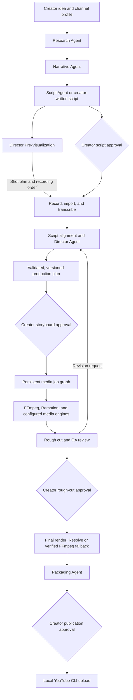

# YouTube AI Studio

[](https://github.com/isbkch/YouTube-AI-Studio/actions/workflows/ci.yml)
[](LICENSE)

A native macOS production dashboard for technical YouTube videos. The creator approves the script, reviews the storyboard, and directs the rough cut. A local TypeScript runtime validates the production plan and executes trusted media workers.

**This repository produces actual media from real footage.** The pipeline ingests camera files, imports word-level transcripts (Final Cut speech analysis, local whisper.cpp, or OpenAI), aligns the approved script against every take, applies a deterministic A-roll edit (take selection, dead-space removal, punch-ins), directs scenes from an 11-template Remotion catalog, renders a 1080p/30 rough cut, and exports Resolve timelines with chapters. The credit-free demo does the same on synthetic A-roll and proves selective rebuilds.

## From idea to published video

| Stage      | What YouTube-AI-Studio does                                                                                                                                  | What you control                                                                        |
| ---------- | ------------------------------------------------------------------------------------------------------------------------------------------------------------ | --------------------------------------------------------------------------------------- |
| Research   | Turns your idea into a brief with key points, labelled claims, counterpoints, and source citations.                                                          | Topic, audience, channel direction, and verification of facts and sources.              |
| Script     | Builds a narrative outline and an A-roll/B-roll shooting script.                                                                                             | Voice, angle, target length, manual edits, and script approval.                         |
| Recording  | Prepares a shot plan, recording order, and teleprompter; copies your footage and imports or generates transcripts.                                           | On-camera delivery, source recordings, transcript accuracy, and transcription provider. |
| Storyboard | Aligns the approved script to your takes and proposes cuts, framing, graphics, and visual treatments.                                                        | Take selection, scene edits, revision requests, and storyboard approval.                |
| Production | Runs trusted media workers to render graphics and B-roll, mix audio, and assemble a 1080p/30 MP4.                                                            | Media providers, generation budget, music library, and visual direction.                |
| Review     | Opens the rough cut with QA results and supports scene or range revisions. Approval starts final rendering through Resolve, with a verified FFmpeg fallback. | Playback review, factual accuracy, media rights, edits, and rough-cut approval.         |
| Packaging  | Proposes titles, thumbnail concepts, a description, timeline-derived chapters, and upload metadata.                                                          | Review of the publication package and approval of its exact saved version.              |
| Publish    | Uploads the approved package and final video through the local YouTube CLI, then records the video ID.                                                       | When to upload and when to make the default private upload public in YouTube Studio.    |

Research citations come from model knowledge and need verification; the Research agent does not browse the web. You can also write the script yourself and enter the same approval and production workflow.

## Start here

Prerequisites: macOS 14+, Xcode command-line tools with Swift 6+, Node.js 24+, Bun 1.4+, and FFmpeg/ffprobe with libx264 and libmp3lame. Paths are detected; Homebrew is not required. Resolve and Blender are optional.

```sh
bun install
bun run check
bun run demo
bun run macos:demo
```

`bun run macos:demo` builds and launches **dist/YouTube-AI-Studio.app** with the demo library. Select the newest “Why Redundancy Is Not High Availability” project and open **Storyboard** or **Review**.

For your real projects:

```sh
bun run macos
```

The normal library is `~/Movies/YouTube-AI-Studio`. `WTS_HOME` or the app's Settings can select another library. The development app uses this checkout and its `node_modules`; retain both. This is an ad-hoc signed development build, not a notarized distribution bundle.

## The usable workflow

1. Create a project with a title, description (the idea), and duration.
2. In **Pre-Production**, run the agent pipeline on the idea — or skip it and write the script yourself. **Run Research** distils an evidence brief (key points, labelled claims, steelmanned counterpoints, canonical sources); **Narrative** turns it into a retention-shaped outline with per-section beats and second budgets; **Draft Full Script** writes the complete shooting script in the A-roll/B-roll format and saves it as a normal script version. **Run Pre-Visualization** directs the edit before you record: a chronological shot plan (`06:30 — deliver on camera: …`) with a regrouped recording order and prep notes. It binds to the current script version and goes visibly stale when the script changes.
3. Paste or edit the script in **Script**. **Save a version**, then **Approve Script**. **Generate Teleprompter** (Pre-Production tab, or `wts teleprompter`) renders the approved script into a reading document — spoken paragraphs as plain text, visual moments as bracketed crew cues, run sheet up top.
4. Drop videos into **Media**, or choose several from the file picker. The app copies each clip and inspects its duration, codec, resolution, frame rate and audio. Import more clips any time before planning.
5. In **Transcript**, import word-level speech analysis straight from Final Cut (**Import Final Cut Analysis…**, or `wts transcript fcp` on an `.fcpbundle`), load timestamped JSON per clip, or transcribe pending clips with **local whisper.cpp** (free, offline) or OpenAI (billed). Import order and durations map takes automatically; same-length retakes are disambiguated by fingerprinting their first spoken words.
6. Optionally review the deterministic A-roll draft (**Draft A-Roll Cut**, or `wts align` / `wts aroll`) — which script sentence is spoken where, in which take, with dead space dropped and scenes grouped at pauses. **Generate Storyboard**: scenes select sub-ranges of takes, cut dead space and retakes, and land near your target duration. Pick the **Silence** pacing control (natural / tight / punchy, or `--tightening` on `wts plan`) to cut interior pauses between words using the transcript's word timings — the deterministic editor does the cutting, never the model. Mock direction is alignment-based and labelled; choose OpenAI for model direction, or **Import Plan…** a plan you authored (`wts plan import`) through the same validation.
7. **Approve Storyboard**, then **Build Rough Cut**. Watch dependencies, progress, logs and failures in **Production**.
8. Watch the local MP4 in **Review**, jump to a scene, and review the automated QA report — decode/duration checks, black/freeze detection, and per-scene vision verdicts against each scene's intent (flagged scenes and generated stills are listed for your judgment). **Open in Resolve** uses the scripting adapter when available. **Resolve Export…** reveals the FCPXML for manual import.
9. Edit a scene through **Inspect / Edit**, ask the Director for a revision, or revise a timeline range — type `3:42-4:10` and a request in Review's Director panel (or `wts revision range <project> 3:42-4:10 "illustrate the failover"`). Inspect the proposed operations and **Apply** or **Reject**. Applying creates a new immutable plan version. Approve that storyboard and rebuild; unchanged assets are reused.
10. **Propose Visual Pass** (or `wts visuals propose`): a second direction pass decides whether the video needs generated B-roll, what each image must communicate, where it belongs, how long it lasts and which narration span it illustrates — plus a music bed and SFX from your curated library (`library/library.json` under the library root) — and proposes it as a patch through the same approval gate. GPT-image (gpt-image-1) renders the stills; motion, inset placement over the live presenter, and sidechain-ducked mixing are deterministic. The pass respects a generation budget (`WTS_IMAGE_BUDGET`, default 8).
11. Approve the rough cut after reviewing it, then finish: **Start Final Render** (or `wts final render`) renders headlessly through Resolve with a validated preset and an optional checked-in Fusion macro (CinematicGrade, FilmGrain, SoftGlow).
12. **Generate Packaging** (Review → Packaging & publishing, or `wts packaging`): the Packaging agent proposes ranked title candidates, thumbnail concepts, the description with the exact chapter timestamps of the rendered timeline, and upload metadata (tags, category, private visibility). **Approve Packaging vN** binds your approval to the document's hash. **Publish to YouTube** (`wts publish`) uploads the final render through the local `youtubeuploader` CLI — argument arrays, no shell, your OAuth handled by the CLI itself (`WTS_YOUTUBEUPLOADER_PATH`, `WTS_YOUTUBE_ARGS`; `wts doctor` reports availability; the pinned official release is downloaded automatically on first publish when the CLI is not installed). Publication is one-shot and recorded with its video ID; visibility stays private until you flip it in YouTube Studio.

Multiple A-roll recordings per project are supported — imported before planning, each with its own transcript — plus 1080p/30fps rough cuts, hard cuts, full-frame graphics from the 11-template catalog, generated B-roll insets with motion, a curated music/SFX bed mixed under the narration, modest presenter punch-ins and audio gain. Sources may have another frame rate or resolution (4K/23.976 camera files verified); conformed 1080p proxies provide a stable edit timebase and originals are never overwritten. Scenes select sub-ranges of any take in script order: retakes, false starts and dead space stay on the cutting room floor, and a QA coverage report lists which recordings the cut actually used. Changing an approved script after media import requires a new project; scene revisions remain available.

## Architecture

The SwiftUI app communicates with a local Node.js runtime over private JSON-lines IPC. The CLI calls the same `Studio` domain service, which owns approvals, versioned artifacts, and the persisted job graph. SQLite stores project state; media and exported artifacts stay in the local library.



Agents return structured documents, plans, or proposed patches. The runtime validates them and invokes checked-in media adapters. Revisions create new plan versions, invalidate downstream approvals, and reuse verified unchanged assets on rebuild.

## Demo and verification

```sh
bun run test                 # Unit, domain, IPC and mocked HTTP-provider tests
bun run test:integration     # Real FFmpeg/proxy/audio and actual Remotion rendering
bun run demo                 # Full 72-second render + selective rebuild assertions
bun run typecheck
bun run lint
bun run format:check
bun run macos:build          # Swift release build and local .app bundle
bun run wts doctor
```

`bun run demo` writes a new project to `.demo/projects/` and a machine-readable receipt at `.demo/demo-result.json`. It leaves both production-plan versions, both rough cuts, source copies, transcripts, asset metadata, logs/jobs in SQLite, QA and timeline exports. No fixture footage or large rendered video is committed. The safe source fixtures and generator are included in [examples/redundancy](examples/redundancy/README.md).

First Remotion use downloads its official Chrome Headless Shell (~94 MB on this Mac). Subsequent renders can run offline. Demo narration uses macOS `say`; no voice cloning or external media is involved.

## CLI

The CLI and app call the same `Studio` domain service. Run `bun run wts --help` for the complete command list.

```sh
bun run wts project create "My video" --description "The idea" --duration 900
bun run wts project list
bun run wts research <project-id> --provider openai
bun run wts narrative <project-id>
bun run wts script draft <project-id>
bun run wts script import <project-id> ./script.txt
bun run wts script approve <project-id> --version 1
bun run wts previsualize <project-id>
bun run wts teleprompter <project-id>
bun run wts media import <project-id> ./recording.mov
bun run wts transcript load <project-id> ./transcript.json
bun run wts transcript fcp <project-id> "~/Movies/Library.fcpbundle"
bun run wts transcribe <project-id> --transcriber whisper
bun run wts align <project-id>          # script ↔ take timing
bun run wts aroll <project-id>          # deterministic edit draft
bun run wts plan <project-id> --provider openai
bun run wts plan import <project-id> ./plan.json
bun run wts storyboard <project-id>
bun run wts plan approve <project-id> --version 1
bun run wts build <project-id>
bun run wts jobs <project-id>
bun run wts final render <project-id>   # Resolve finishing
bun run wts packaging <project-id>       # titles/description/chapters/metadata
bun run wts packaging approve <project-id> --version 1
bun run wts publish <project-id>          # YouTube CLI upload, after approval
bun run wts project delete <project-id> --yes  # remove the project workspace
```

Always quote paths containing spaces. `render` is an alias for local rough-cut build, not a final Resolve delivery render. Ctrl-C cancels work and retains completed cache entries. Deleting a project (also available as Delete Project in the app) removes its scripts, plans, renders, database rows and the imported copies of your recordings from the library — the original files you imported from are never touched.

## Credentials

Save the OpenAI key in the app's Settings. Swift uses Keychain Services with a device-local, unlocked-keychain item (`com.isbkch.YouTube-AI-Studio` / `openai`). The app sends the key to its private child process only when OpenAI is selected; it never writes it to project files. The CLI retrieves the same item through the system Keychain utility. Mock is the default.

Credentials resolve from `OPENAI_API_KEY` in the repository `.env` first, then Keychain. The configurable Director model defaults to `gpt-5.4`; planning and revisions use the Responses API with strict structured outputs and `store: false`. Transcription has three providers: **mock** (imported fixtures), **whisper** (local whisper.cpp via `whisper-cli`, free and offline — the ggml model, default `~/.whisper-models/ggml-small.bin`, is downloaded automatically from the whisper.cpp repository on first use; `WTS_WHISPER_MODEL` points elsewhere), and **openai** (`whisper-1`, word+segment timestamps, 16 kHz mono MP3, 24 MB upload limit with an actionable error beyond it). Final Cut `.fcptranscript` import needs no provider at all.

## Repository map

| Location                   | Responsibility                                                                                                                                      |
| -------------------------- | --------------------------------------------------------------------------------------------------------------------------------------------------- |
| `apps/macos`               | SwiftUI interface, AVKit playback, Keychain, private runtime client                                                                                 |
| `packages/orchestrator`    | Domain commands, SQLite, state, jobs, cache, preview, CLI, IPC                                                                                      |
| `packages/production-plan` | Strict schema, JSON Schema, inferred TS types, semantic validation, patches                                                                         |
| `packages/agents`          | Provider abstraction, mock/OpenAI/whisper.cpp, pre-production agents (research/narrative/script/pre-visualization), Director, transcript validation |
| `packages/media`           | Tool detection, safe subprocesses, ffprobe, import, proxy, audio, QA                                                                                |
| `packages/remotion-engine` | Trusted SSR rendering adapter                                                                                                                       |
| `templates/remotion`       | The 11-template graphic catalog and the synthetic demo presenter                                                                                    |
| `packages/image-engine`    | Generated B-roll stills (mock gradients, OpenAI `gpt-image-1`, Gemini Nano Banana) turned into deterministic motion clips                           |
| `packages/music-engine`    | Music beds from the creator library, local synthesis, or Gemini Lyria generation                                                                    |
| `packages/blender-engine`  | Headless EEVEE renders of the six checked-in 3D B-roll templates                                                                                    |
| `packages/resolve-engine`  | Explicit Resolve probe/import adapter; no GUI automation                                                                                            |
| `packages/shared`          | Errors, hashing, safe paths, usage and creator profile                                                                                              |

Read [architecture](docs/architecture.md), [development](docs/development.md), [Resolve support](docs/resolve.md), [troubleshooting](docs/troubleshooting.md), [verification evidence](docs/verification.md), and [PROGRESS.md](PROGRESS.md).

## Contributing

Issues and pull requests are welcome. Start with [CONTRIBUTING.md](CONTRIBUTING.md) for setup, the checks your change must pass, and the project's ground rules — domain gates live in one service, production plans stay honest, and media engines fail closed. By participating you agree to the [Code of Conduct](CODE_OF_CONDUCT.md). Report security issues privately per [SECURITY.md](SECURITY.md), never in public issues.

## License

Copyright 2026 iLyas Bakouch. Source-available under the
[Elastic License 2.0](LICENSE): you may use, copy, modify, and redistribute the
software, with three limitations — you may not offer it to third parties as a
hosted or managed service, may not circumvent any license-key protection, and
may not remove or obscure licensing, copyright, or trademark notices.
Dependencies brought in at install time remain under their own licenses.
