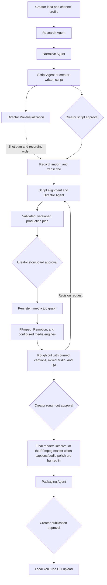

# YouTube AI Studio

[](https://github.com/isbkch/YouTube-AI-Studio/actions/workflows/ci.yml)
[](LICENSE)

A native macOS production dashboard for technical YouTube videos. The creator hires a director, approves the script, reviews the storyboard, and approves the rough cut. A local TypeScript runtime validates the production plan and executes trusted media workers.

**This repository produces actual media from real footage.** The pipeline ingests camera files, imports word-level transcripts (Final Cut speech analysis, local whisper.cpp, or OpenAI), aligns the approved script against every take, applies a deterministic A-roll edit (take selection, dead-space removal, punch-ins), directs scenes from an 11-template Remotion catalog, layers animated punch-line captions and engineered narration from your hired director, renders a 1080p/30 rough cut, and exports Resolve timelines with chapters. The credit-free demo does the same on synthetic A-roll and proves selective rebuilds.

## From idea to published video

| Stage      | What YouTube-AI-Studio does                                                                                                                                                                                      | What you control                                                                                                                                                                           |
| ---------- | ---------------------------------------------------------------------------------------------------------------------------------------------------------------------------------------------------------------- | ------------------------------------------------------------------------------------------------------------------------------------------------------------------------------------------ |
| Research   | Turns your idea into a brief with key points, labelled claims, counterpoints, and source citations.                                                                                                              | Topic, audience, channel direction, and verification of facts and sources.                                                                                                                 |
| Script     | Builds a narrative outline and an A-roll/B-roll shooting script.                                                                                                                                                 | Voice, angle, target length, manual edits, and script approval.                                                                                                                            |
| Recording  | Prepares a shot plan, recording order, and teleprompter; copies your footage and imports or generates transcripts.                                                                                               | On-camera delivery, source recordings, transcript accuracy, and transcription provider.                                                                                                    |
| Storyboard | Aligns the approved script to your takes; your hired director proposes cuts, framing, graphics, pacing, punch-line captions and sound temperament.                                                               | Which director you hire (Purist / Craftsman / Showman), take selection, scene edits, revision requests, and storyboard approval — or delegate it to the Producer on an autonomous project. |
| Production | Runs trusted media workers to render graphics and B-roll, burn animated punch-line captions, engineer the narration, mix music/SFX, and assemble a 1080p/30 MP4.                                                 | Media providers, generation budget, music library, and visual direction.                                                                                                                   |
| Review     | Opens the rough cut with QA results and supports scene or range revisions. Approval starts final rendering — through Resolve, or the verified FFmpeg master when captions or narration processing are burned in. | Playback review, factual accuracy, media rights, edits, and rough-cut approval — or delegate it to the Producer, which escalates on any QA deviation.                                      |
| Packaging  | Proposes titles, thumbnail concepts, a description, timeline-derived chapters, and upload metadata.                                                                                                              | Review of the publication package and approval of its exact saved version.                                                                                                                 |
| Publish    | Uploads the approved package and final video through the local YouTube CLI, then records the video ID.                                                                                                           | When to upload and when to make the default private upload public in YouTube Studio.                                                                                                       |

Research citations come from model knowledge and need verification; the Research agent does not browse the web. You can also write the script yourself and enter the same approval and production workflow.

## Start here

Prerequisites: macOS 14+, Xcode command-line tools with Swift 6+, Node.js 24+, Bun 1.4+, and FFmpeg/ffprobe with libx264 and libmp3lame. Paths are detected; Homebrew is not required. Resolve and Blender are optional.

```sh
bun install
bun run check
bun run demo
bun run macos:demo
```

`bun run macos:demo` builds and launches **dist/YouTube-AI-Studio.app** with the demo library. Select the newest “Why Redundancy Is Not High Availability” project and open **Storyboard** or **Review**.

For your real projects:

```sh
bun run macos
```

The normal library is `~/Movies/YouTube-AI-Studio`. `WTS_HOME` or the app's Settings can select another library. The development app uses this checkout and its `node_modules`; retain both. This is an ad-hoc signed development build, not a notarized distribution bundle.

## The usable workflow

1. Create a project with a title, description (the idea), and duration — and choose its **autonomy**: **Supervised** (every gate is yours) or **Autonomous** (the Producer advances the machine gates). You can switch any time in the Overview tab or with `wts autonomy <project> supervised|autonomous`; script approval and publication approval stay yours in both modes.
2. In **Pre-Production**, run the agent pipeline on the idea — or skip it and write the script yourself. **Run Research** distils an evidence brief (key points, labelled claims, steelmanned counterpoints, canonical sources); **Narrative** turns it into a retention-shaped outline with per-section beats and second budgets; **Draft Full Script** writes the complete shooting script in the A-roll/B-roll format and saves it as a normal script version. **Run Pre-Visualization** directs the edit before you record: a chronological shot plan (`06:30 — deliver on camera: …`) with a regrouped recording order and prep notes. It binds to the current script version and goes visibly stale when the script changes.
3. Paste or edit the script in **Script**. **Save a version**, then **Approve Script**. **Generate Teleprompter** (Pre-Production tab, or `wts teleprompter`) renders the approved script into a reading document — spoken paragraphs as plain text, visual moments as bracketed crew cues, run sheet up top.
4. Drop videos into **Media**, or choose several from the file picker. The app copies each clip and inspects its duration, codec, resolution, frame rate and audio. Import more clips any time before planning.
5. In **Transcript**, import word-level speech analysis straight from Final Cut (**Import Final Cut Analysis…**, or `wts transcript fcp` on an `.fcpbundle`), load timestamped JSON per clip, or transcribe pending clips with **local whisper.cpp** (free, offline) or OpenAI (billed). Import order and durations map takes automatically; same-length retakes are disambiguated by fingerprinting their first spoken words. Consecutive repeated sentences within a clip keep the last complete delivery in the transcript review and new A-roll drafts, including small article/filler differences. **Show all attempts** reveals the original transcript. Short beats, distinct claims, distant repeats and deliberate script repetition remain intact. Existing storyboards keep their approved selections.
6. Optionally review the deterministic A-roll draft (**Draft A-Roll Cut**, or `wts align` / `wts aroll`) — which script sentence is spoken where, in which take, with dead space dropped and scenes grouped at pauses. **Generate Storyboard**: scenes select sub-ranges of takes, cut dead space and retakes, and land near your target duration. Before generating, **hire your director** — the storyboard's director cards (or `--director` on `wts plan` / `wts aroll`) choose the persona that drives every editing decision: **The Purist** (straight cuts, minimal visuals, sound as recorded), **The Craftsman** (rich visuals, tight pacing, pop-in punch-line captions, compressed narration, punctuating SFX), or **The Showman** (punchy cuts, karaoke captions that highlight each spoken word, dense SFX, a loud normalized mix). Captions are derived deterministically from the transcript — the viewer only ever reads what was spoken — and the storyboard shows exactly which punch lines got captioned. Advanced `--density` / `--tightening` flags still override individual knobs. Mock direction is alignment-based and labelled; choose OpenAI for model direction, or **Import Plan…** a plan you authored (`wts plan import`) through the same validation.
7. **Approve Storyboard**, then **Build Rough Cut**. Watch dependencies, progress, logs and failures in **Production**.
8. Watch the local MP4 in **Review**, jump to a scene, and review the automated QA report — decode/duration checks, black/freeze detection, and per-scene vision verdicts against each scene's intent (flagged scenes and generated stills are listed for your judgment). **Open in Resolve** uses the scripting adapter when available. **Resolve Export…** reveals the FCPXML for manual import.
9. Edit a scene through **Inspect / Edit**, ask the Director for a revision, or revise a timeline range — type `3:42-4:10` and a request in Review's Director panel (or `wts revision range <project> 3:42-4:10 "illustrate the failover"`). Inspect the proposed operations and **Apply** or **Reject**. Applying creates a new immutable plan version. Approve that storyboard and rebuild; unchanged assets are reused.
10. **Propose Visual Pass** (or `wts visuals propose`): a second direction pass decides whether the video needs generated B-roll, what each image must communicate, where it belongs, how long it lasts and which narration span it illustrates — plus a music bed and SFX from your curated library (`library/library.json` under the library root) or the built-in synthesized SFX bank (whoosh, pop, riser — no downloads, no licensing), tempered by your hired director. It proposes everything as a patch through the same approval gate. GPT-image (gpt-image-1) renders the stills; motion, inset placement over the live presenter, and sidechain-ducked mixing are deterministic. The pass respects a generation budget (`WTS_IMAGE_BUDGET`, default 8).
11. Approve the rough cut after reviewing it, then finish: **Start Final Render** (or `wts final render`) renders headlessly through Resolve with a validated preset and an optional checked-in Fusion macro (CinematicGrade, FilmGrain, SoftGlow). Prefer to finish manually? Grade in Resolve, then **Adopt Resolve Render…** (or `wts final deliver`) — the file is verified against the plan (resolution, frame rate, duration, audio) and becomes the final master. **Resolve Markers** reads your timeline markers back as scene-mapped notes for the next revision.
12. **Generate Packaging** (Review → Packaging & publishing, or `wts packaging`): the Packaging agent proposes ranked title candidates, thumbnail concepts, the description with the exact chapter timestamps of the rendered timeline, and upload metadata (tags, category, private visibility). **Render A/B** turns the first two concepts into thumbnails using the image provider selected in Settings. **Compare & edit…** shows large and feed-size previews; edit headlines locally, regenerate individual backgrounds, select an exact revision for upload, or export both images for a manual experiment in YouTube Studio. **Approve Packaging vN** binds your approval to the document's hash and the selected thumbnail's bytes (a custom thumbnail is optional). **Publish to YouTube** (`wts publish`) uploads the final render through the local `youtubeuploader` CLI — argument arrays, no shell, your OAuth handled by the CLI itself (`WTS_YOUTUBEUPLOADER_PATH`, `WTS_YOUTUBE_ARGS`; `wts doctor` reports availability; the pinned official release is downloaded automatically on first publish when the CLI is not installed). Publication is one-shot and recorded with its video ID; visibility stays private until you flip it in YouTube Studio. If the CLI creates the video but fails afterward, the app preserves that video ID and directs you to YouTube Studio to finish, preventing a duplicate upload.
13. **Autonomous projects — the Producer.** On an autonomous project a deterministic reviewer (`deterministic-v1`) carries the machine gates for you: after the storyboard is generated it reviews script coverage (escalating when more than 25% of approved sentences are omitted) and the duration budget, approves the storyboard, auto-applies the visual-direction pass once per script, builds, reviews the QA report (escalating on any warning or flagged scene), approves the rough cut, awaits the final render, generates packaging — and stops at publication approval, which is permanently yours. Every review and its findings are persisted on the project and shown in the Overview tab; auto-approvals are labelled "auto-approved by Producer". A step that fails or escalates stops the chain with a triaged findings list and leaves the project waiting for you; nothing rolls back. **Run Producer** in the Overview tab (or `wts producer <project>`) is the manual catch-up button.

Thumbnail rendering makes at most one image-generation request per requested variant. Successful images survive cancellation or a failure in the other variant; retry only the failed slot. Headline edits reuse the saved background with no image-generation call. Background regeneration is explicit, and successful revisions remain available in **Previous versions**. A selected revision stays pinned until you choose another; changing the selection clears publication approval. Regenerating packaging archives its thumbnails and starts a fresh A/B pair. Export writes exact 1280×720 JPEGs and a manifest into a new folder. After publication, thumbnails remain available for comparison and export, with editing locked. Mock mode produces labeled gradient previews; v1 uses technical subjects and has no portrait input or live experiment management.

Multiple A-roll recordings per project are supported — imported before planning, each with its own transcript — plus 1080p/30fps rough cuts, hard cuts, full-frame graphics from the 11-template catalog, generated B-roll insets with motion, animated punch-line captions burned over the cut, a curated music/SFX bed with engineered narration mixed under it, modest presenter punch-ins and audio gain. Sources may have another frame rate or resolution (4K/23.976 camera files verified); conformed 1080p proxies provide a stable edit timebase and originals are never overwritten. Scenes select sub-ranges of any take in script order: retakes, false starts and dead space stay on the cutting room floor, and a QA coverage report lists which recordings the cut actually used. Changing an approved script after media import requires a new project; scene revisions remain available.

## Architecture

The SwiftUI app communicates with a local Node.js runtime over private JSON-lines IPC. The CLI calls the same `Studio` domain service, which owns approvals, versioned artifacts, and the persisted job graph. SQLite stores project state; media and exported artifacts stay in the local library.



Agents return structured documents, plans, or proposed patches. The runtime validates them and invokes checked-in media adapters. Revisions create new plan versions, invalidate downstream approvals, and reuse verified unchanged assets on rebuild.

**Autonomy — the Producer.** Each project is `supervised` (default) or `autonomous`. On autonomous projects the deterministic Producer (`packages/orchestrator/src/producer.ts`, no model calls, zero cost) auto-approves the machine gates — storyboard and rough cut — with a total evidence trail: reviews and findings persist in `Project.producerReviews`, approvals record `approvedBy: "producer"`, and any failed check (omission ratio over 25%, duration outside 0.4×–1.6× of target, any QA warning or flagged scene) escalates the gate back to you instead of shipping. The script gate (your words) and the publication gate (one-shot external upload) are never auto-approved in any mode.

## Demo and verification

```sh
bun run test                 # Unit, domain, IPC and mocked HTTP-provider tests
bun run test:integration     # Real FFmpeg/proxy/audio and actual Remotion rendering
bun run demo                 # Full 72-second render + selective rebuild assertions
bun run typecheck
bun run lint
bun run format:check
bun run macos:build          # Swift release build and local .app bundle
bun run wts doctor
```

`bun run demo` writes a new project to `.demo/projects/` and a machine-readable receipt at `.demo/demo-result.json`. It leaves both production-plan versions, both rough cuts, source copies, transcripts, asset metadata, logs/jobs in SQLite, QA and timeline exports. No fixture footage or large rendered video is committed. The safe source fixtures and generator are included in [examples/redundancy](examples/redundancy/README.md).

First Remotion use downloads its official Chrome Headless Shell (~94 MB on this Mac). Subsequent renders can run offline. Demo narration uses macOS `say`; no voice cloning or external media is involved.

## CLI

The CLI and app call the same `Studio` domain service. Run `bun run wts --help` for the complete command list.

```sh
bun run wts project create "My video" --description "The idea" --duration 900
bun run wts project list
bun run wts research <project-id> --provider openai
bun run wts narrative <project-id>
bun run wts script draft <project-id>
bun run wts script import <project-id> ./script.txt
bun run wts script approve <project-id> --version 1
bun run wts previsualize <project-id>
bun run wts teleprompter <project-id>
bun run wts media import <project-id> ./recording.mov
bun run wts transcript load <project-id> ./transcript.json
bun run wts transcript fcp <project-id> "~/Movies/Library.fcpbundle"
bun run wts transcribe <project-id> --transcriber whisper
bun run wts align <project-id>          # script ↔ take timing
bun run wts aroll <project-id> --director craftsman   # deterministic edit draft
bun run wts plan <project-id> --provider openai --director showman
bun run wts plan import <project-id> ./plan.json
bun run wts storyboard <project-id>
bun run wts plan approve <project-id> --version 1
bun run wts build <project-id>
bun run wts jobs <project-id>
bun run wts final render <project-id>   # Resolve finishing
bun run wts final deliver <project-id> /absolute/master.mp4  # adopt your Resolve render
bun run wts resolve markers <project-id>  # read review markers back from Resolve
bun run wts packaging <project-id>       # titles/description/chapters/metadata
bun run wts thumbnails <project-id> --images mock  # explicitly render A/B
bun run wts thumbnails get <project-id>
bun run wts thumbnails edit <project-id> A --headline "TWO SERVERS. ONE FAILURE."
bun run wts thumbnails <project-id>     # render the saved edit; reuse the background
bun run wts thumbnails regenerate <project-id> B # one new background
bun run wts thumbnails select <project-id> A --revision 1 # or select <project-id> none
bun run wts thumbnails export <project-id> /absolute/export/folder
bun run wts packaging approve <project-id> --version 1
bun run wts publish <project-id>          # YouTube CLI upload, after approval
bun run wts costs <project-id>            # estimated API spend (project + library)
bun run wts project delete <project-id> --yes  # remove the project workspace
```

Always quote paths containing spaces. `render` is an alias for local rough-cut build, not a final Resolve delivery render. Ctrl-C cancels work and retains completed cache entries. Deleting a project (also available as Delete Project in the app) removes its scripts, plans, renders, database rows and the imported copies of your recordings from the library — the original files you imported from are never touched.

## Credentials

Save the OpenAI key in the app's Settings. Swift uses Keychain Services with a device-local, unlocked-keychain item (`com.isbkch.YouTube-AI-Studio` / `openai`). The app sends the key to its private child process only when OpenAI is selected; it never writes it to project files. The CLI retrieves the same item through the system Keychain utility. Mock is the default.

Credentials resolve from `OPENAI_API_KEY` in the repository `.env` first, then Keychain. The configurable Director model defaults to `gpt-5.4`; planning and revisions use the Responses API with strict structured outputs and `store: false`. Transcription has three providers: **mock** (imported fixtures), **whisper** (local whisper.cpp via `whisper-cli`, free and offline — the ggml model, default `~/.whisper-models/ggml-small.bin`, is downloaded automatically from the whisper.cpp repository on first use; `WTS_WHISPER_MODEL` points elsewhere), and **openai** (`whisper-1`, word+segment timestamps, 16 kHz mono MP3, 24 MB upload limit with an actionable error beyond it). Final Cut `.fcptranscript` import needs no provider at all.

## Costs

Every billed call — direction, revisions, transcription, stills, music, visual QA, packaging — is recorded as a `Usage` row (agent, provider, model, tokens, audio seconds, images) and priced by the runtime against the checked-in rate table in `packages/shared/src/costs.ts`: text models per 1M input/output tokens, transcription per audio minute, `gpt-image-1` per billed token (per-image fallback for rows without token usage), Gemini stills per image, and Lyria clips as an unpublished per-second estimate. Local engines — mock, whisper.cpp, Blender, FFmpeg — record $0. A model without a pricing rule is counted as **unpriced** and surfaced, never folded silently into the total. Totals are estimates and drift from invoices.

The app keeps the running total visible in the sidebar (`Costs · $x.xx`) and updates it live as jobs complete; the Costs sheet breaks spend down per agent/model with call counts and quantities, plus library-wide totals and a per-production list. The CLI reports the same numbers via `bun run wts costs <project-id>`, and `project list` includes each project's summary.

## Repository map

| Location                   | Responsibility                                                                                                                                      |
| -------------------------- | --------------------------------------------------------------------------------------------------------------------------------------------------- |
| `apps/macos`               | SwiftUI interface, AVKit playback, Keychain, private runtime client                                                                                 |
| `packages/orchestrator`    | Domain commands, SQLite, state, jobs, cache, preview, CLI, IPC                                                                                      |
| `packages/production-plan` | Strict schema, JSON Schema, inferred TS types, semantic validation, patches                                                                         |
| `packages/agents`          | Provider abstraction, mock/OpenAI/whisper.cpp, pre-production agents (research/narrative/script/pre-visualization), Director, transcript validation |
| `packages/media`           | Tool detection, safe subprocesses, ffprobe, import, proxy, audio, QA                                                                                |
| `packages/remotion-engine` | Trusted SSR rendering adapter                                                                                                                       |
| `templates/remotion`       | The 11-template graphic catalog, the animated caption composition, and the synthetic demo presenter                                                 |
| `packages/image-engine`    | Generated B-roll stills (mock gradients, OpenAI `gpt-image-1`, Gemini Nano Banana) turned into deterministic motion clips                           |
| `packages/music-engine`    | Music beds from the creator library, local synthesis, or Gemini Lyria generation                                                                    |
| `packages/blender-engine`  | Headless EEVEE renders of the six checked-in 3D B-roll templates                                                                                    |
| `packages/resolve-engine`  | Explicit Resolve probe/import/render/markers adapter; verified render delivery back into the library; no GUI automation                             |
| `packages/shared`          | Errors, hashing, safe paths, usage and creator profile                                                                                              |

Read [architecture](docs/architecture.md), [development](docs/development.md), [Resolve support](docs/resolve.md), [troubleshooting](docs/troubleshooting.md), [verification evidence](docs/verification.md), and [PROGRESS.md](PROGRESS.md).

## Contributing

Issues and pull requests are welcome. Start with [CONTRIBUTING.md](CONTRIBUTING.md) for setup, the checks your change must pass, and the project's ground rules — domain gates live in one service, production plans stay honest, and media engines fail closed. By participating you agree to the [Code of Conduct](CODE_OF_CONDUCT.md). Report security issues privately per [SECURITY.md](SECURITY.md), never in public issues.

## License

Copyright 2026 iLyas Bakouch. Source-available under the
[Elastic License 2.0](LICENSE): you may use, copy, modify, and redistribute the
software, with three limitations — you may not offer it to third parties as a
hosted or managed service, may not circumvent any license-key protection, and
may not remove or obscure licensing, copyright, or trademark notices.
Dependencies brought in at install time remain under their own licenses.

### Transcript quality

[GPT Transcribe, audio checks, listening review, revision history and the recording benchmark](docs/transcription-quality.md).
