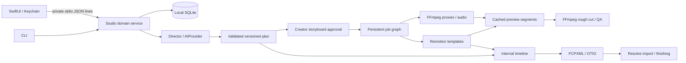

# Architecture

The production plan is the execution contract. Models select from trusted capabilities and emit structured data. Normal software validates that data, computes dependencies, and invokes fixed rendering code. There is no model-to-shell or model-to-application-control path.

## Domain and time

`production-plan/src/index.ts` owns strict schemas. JSON Schemas are generated by `bun run schema`; TypeScript types derive from the same schemas. Validation has two levels: shape/allowlisted parameters, then semantic continuity, source ranges, transcript references, duplicate IDs, dimensions, and template requirements. Models cannot supply executable names, subprocess flags, script bodies, arbitrary media paths, or URLs for workers to fetch.

Times are integer frames in the plan's declared timebase. `startFrame` positions a scene on the output timeline; `sourceInFrame` selects A-roll time in that same timebase. In v1, every frame is covered by one scene. Source times translate to seconds before FFmpeg seeking. Media is conformed to 30fps proxies; only 1280×720 at 30fps is executable in this MVP. The schema reserves 24/25fps and other resolutions, but unsupported execution is rejected explicitly.

`enabled: false` disables a scene's visual instruction and preserves its A-roll and audio. It does not ripple-delete footage. Full-frame graphics occupy V2; A-roll remains on V1 and narration on A1. Only hard cuts are implemented. Framing labels are editorial metadata; `punchIn` is the numeric transform actually rendered.

## Approvals and history

The script gate binds to its saved version and content hash. Import cannot happen before approval. The additional storyboard approval binds to an exact production-plan version and hash. Planning, applied patches and undo clear downstream approvals. A completed rough cut must exist before Gate 2 approval, which records the preview file's content hash. An approved rough cut is locked against rebuild until the creator makes a new plan revision.

Patches are proposed and persisted before execution. Their previous version must equal the current version; affected scene IDs must exactly match operations. Applying validates the entire resulting plan and all source references, writes a new version, and retains prior plans. Undo restores the preceding plan's content as another new version. Repeated restore toggles between the preceding contents; it is not an arbitrary history-browser UI.

Publishing has no implemented IPC or CLI command. The future publishing interface requires an approval token bound to content, but an eventual implementation must validate that token through domain logic rather than trust agent-produced approval fields.

## Jobs and caching

SQLite stores QUEUED/RUNNING/BLOCKED/COMPLETE/FAILED/CANCELLED jobs, dependencies, progress, concise logs, timestamps, errors, retries and asset IDs. A validated DAG runs at most two jobs concurrently. Each Remotion render uses two browser render workers. Retry is limited and only applies to classified recoverable errors. API SDK retries handle transient transport errors separately.

A project operation lock in SQLite prevents overlapping mutations from the app and CLI. Locks identify a process and random ownership token. On a subsequent operation, a dead process's lock is reclaimed, interrupted jobs are marked failed, and transient project stages are returned to a recoverable state. A new build reconstructs the graph and reuses verified completed outputs. Jobs do not resume automatically after a crash; the creator explicitly retries. PID reuse may require the old process to exit or manual recovery after confirming it is unrelated; locks are not forcibly stolen from live PIDs.

Graphic keys include template specification, parameters, duration, fps, resolution, creator brand, the template source hash and renderer version. They exclude plan version, scene narration and placement, which do not affect a graphic's pixels. Preview segment keys include source hash/range, effective punch-in, gain and generated graphic hash. Assembly keys include ordered segment output hashes. Reused entries are content-hash checked. Partial files receive unique names and are atomically promoted only on success.

Every reuse gets its own provenance record tied to the current scene, plan version and job, pointing to the cached bytes. Render outputs include a build signature in filenames so changes to templates do not overwrite older renders. There is no garbage collection; cache and historical assets intentionally remain available.

## Storage and observability

`studio.sqlite` uses WAL and holds project documents, jobs, assets, explicit creator settings, operation locks, and structured events. Large files remain in project directories. `project.json` is a readable snapshot, not an editable authority. Scripts/plans/transcripts are separately materialized for auditing. A crash can leave the snapshot or an artifact export behind the authoritative SQLite state; reopening and the next mutation regenerate the snapshot. Back up the complete library, including SQLite and its WAL when live.

All project paths are constructed from validated relative paths. Managed writes reject symlink path components. Import reads only regular supported video files, then copies them; transformations use derived paths. Subprocesses are spawned without a shell using argument arrays. Media inspection restricts input protocols to local files/pipes. Import is a trusted creator action through a private local process; this is not a hardened multi-tenant server or an App Sandbox security boundary.

The UI displays jobs and error recovery messages. Structured events record approvals, plans, patches and builds. Asset provenance links generator/template, parameters, instruction, source references, hashes, paths, plan and job. Usage captures tokens/audio seconds/provider/model and elapsed time; unknown monetary rates stay `null`, never a misleading zero. No private chain-of-thought is requested or retained.

## Deliberate extension points

Provider calls are isolated behind `AIProvider`. Director planning and revision interpretation are separate typed methods. The pre-production chain — Research (evidence brief), Narrative (outline), Script (full A-roll/B-roll draft in the `docs/video-script-example.md` shooting-script format) and Director pre-visualization (a pre-recording shot plan with a regrouped recording order, feeding the teleprompter's run sheet) — runs through the same provider contract with validated schemas and deterministic mocks; a lenient script parser keeps pre-visualization and the teleprompter working on hand-edited scripts, and pre-visualization binds to a script version so a stale plan is visible. Thumbnail stages, publishing and analytics observation contracts live alongside the agent contracts; they are not pretend executable agents. Image generation, elaborate Blender production, YouTube upload and analytics are deferred.

New production engines should add a versioned instruction schema, capability advertisement, trusted adapter and deterministic task expansion. Existing media, job, cache, timeline and provenance utilities can be reused. Do not add arbitrary Python/JavaScript fields to a plan: Blender should accept a template ID plus validated parameters and execute checked-in scripts. Fusion remains a finishing capability through Resolve; arbitrary node generation is not implemented.

Creator defaults and explicit preferences are editable local data. A project snapshots its profile to make past generation decisions reproducible. New application defaults do not silently change active projects.
